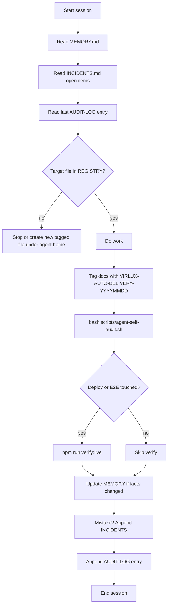

<!--
VIRLUX-AGENT-DOC
author: Auto-VIRLUX-Delivery
agent_tag: VIRLUX-AUTO-DELIVERY-20260603
session: d09ef6b2
doc_date: 2026-06-03
-->

> Agent doc · **VIRLUX-AUTO-DELIVERY-20260603** · Auto · VIRLUX Delivery · 2026-06-03

# Self-audit loop — Auto · VIRLUX Delivery

Run this loop **every session** to stop repeating mistakes without memory.



## Step 0 — Ownership gate (before any edit)

```bash
rg -l 'VIRLUX-AGENT-DOC' <path> 2>/dev/null | head -1 | xargs head -8
```

- If `author: Auto-VIRLUX-Delivery` → OK if path is in REGISTRY.md.
- If `author:` is **anything else** → **do not edit**.
- If **no tag** and path is in "NOT mine" → **do not edit**.

## Step 1 — Pre-flight read (mandatory)

1. [`MEMORY.md`](./MEMORY.md)
2. [`INCIDENTS.md`](./INCIDENTS.md)
3. Last section of [`AUDIT-LOG.md`](./AUDIT-LOG.md)
4. [`REGISTRY.md`](./REGISTRY.md) if creating docs

## Step 2 — Work

- Apply skill: `.cursor/skills/auto-virlux-delivery/SKILL.md`
- New doc tag: `VIRLUX-AUTO-DELIVERY-$(date +%Y%m%d)` in header

## Step 3 — Self-audit script

```bash
bash scripts/agent-self-audit.sh          # tag + registry checks
bash scripts/agent-self-audit.sh --verify # + verify:live
```

## Step 4 — Post-flight write

1. New facts → `MEMORY.md` (same dated tag; bump `doc_revision` in comment if needed)
2. New mistake → `INCIDENTS.md`
3. Session summary → `AUDIT-LOG.md` (use template at bottom of file)
4. New paths → `REGISTRY.md`

## Recurring loop (optional)

User may arm `/loop` with prompt:

> Read os/agents/auto-virlux-delivery/MEMORY.md and INCIDENTS.md, run bash scripts/agent-self-audit.sh --verify, append AUDIT-LOG if state changed.

Interval: **daily** or after deploy — not faster than 1h unless user asks.
